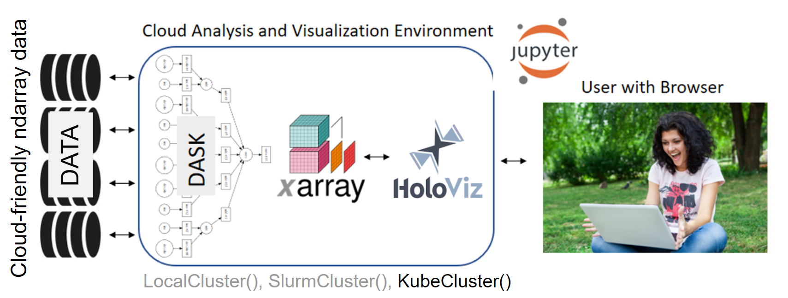

# Pangeo Tutorial

This repository tutorial materials for half- to full-day workshops that showcase Pangeo JupyterHub deployments. The `notebooks` directory has Jupyter notebooks that illustrate key python libraries including dask, xarray, holoviz, geopandas and intake. 

  

-----

- **[About Pangeo](https://pangeo.io/):** Pangeo is a community effort for big data in the geosciences using Python. A key component of the Pangeo effort is the improved integration of Xarray, Dask and Holoviz to enable analysis and visualization of very large datasets.
- **[About Dask](https://dask.pydata.org/en/latest/index.html):** Dask is a flexible parallel computing library for analytic computing. [Dask Tutorial](https://tutorial.dask.org)
- **[About Xarray](https://xarray.pydata.org/en/latest/index.html):** Xarray is an open source project and Python package that aims to bring the labeled data power of pandas to the physical sciences, by providing N-dimensional variants of the core pandas data structures. [Xarray Tutorial](http://xarray.pydata.org/en/stable/weather-climate.html)
- **[About Geopandas](https://geopandas.org):** Geopandas is a library to facilitate analysis of geospatial vector data. [GeoPandas Tutorial](https://github.com/jorisvandenbossche/geopandas-tutorial)
- **[About HoloViz](https://holoviz.org/):** HoloViz provides a coordinated set of high-level tools for visualizing data:  Panel for making apps and dashboards, hvPlot to easily generate interactive plots, HoloViews to make data visualizable, GeoViews to extend HoloViews for geographic data, Datashader for rendering large datasets, Param to create declarative user-configurable objects, and Colorcet for perceptually uniform colormaps. [HoloViz Tutorial](https://holoviz.org/tutorial/index.html)
- **[About Intake](https://intake.readthedocs.io/en/latest/index.html):** Intake is a cataloging system designed to "Take the pain out of data access and distribution". [Intake Tutorial](https://github.com/intake/intake-examples/tree/master/tutorial)
- **[About Jupyter](https://jupyter.org/):** Project Jupyter exists to develop open-source software, open-standards, and services for interactive computing across dozens of programming languages. The Jupyter Notebook is an open-source web application that allows you to create and share documents that contain live code, equations, visualizations and narrative text. Uses include: data cleaning and transformation, numerical simulation, statistical modeling, data visualization, machine learning, and much more. [Jupyter Tutorial](https://github.com/scottythered/absolute-basics-of-jupyter)

## Run this Pangeo Tutorial

***Note: Binder is an emphermal computing environment, so use download, github or gist if you want to save work.  It also runs on publicly-accessible infrastructure so don't store passwords, keys or tokens!

| Basic content  | 
| ------------- | 
|  |

Notebooks in subfolders `amazon-web-services` and `google-cloud` combine all these Python libraries and use cluster configurations and datasets stored on Google Cloud (GCP) or Amazon Cloud (AWS). The following binder links launch a [predefined computational environment](https://hub.docker.com/r/pangeo/pangeo-notebook/tags) in different Cloud data centers, allowing us to upload our computation rather than download data:

| AWS-specific content  | GCP-specific content |
| ------------- | ------------- |
|  | |

## Past Workshops

* 2018 AGU workshop: [Scalable Geoscience Tools in Python — Xarray, Dask, and Jupyter](https://agu.confex.com/agu/fm18/meetingapp.cgi/Session/52170).
* 2019 AGU workshop: [Pangeo: Hands on with JupyterHub and Open-source Python Tools for Scalable Analysis of Big Data in the Geosciences](https://www.agu.org/Events/SCIWS12-Pangeo)

## Acknowledgements

At its core, Pangeo is a community effort built around open-source software. As such, the credit for the developments of the software described here belongs with the community that created it.

Elements of this tutorial were taken from the xarray, Dask, Cartopy, Holoviews, and GeoPandas documentation. Some pieces of text in the xarray portion of the tutorial were adapted from Hoyer and Hamman (2016).

Pangeo is [supported](https://www.nsf.gov/awardsearch/showAward?AWD_ID=1740633&HistoricalAwards=false) by the [National Science Foundation (NSF)](https://www.nsf.gov/) via the [EarthCube Program](https://www.earthcube.org/) and the [National Aeronautics and Space Administration](https://www.nasa.gov/) via the [ACCESS Program](https://earthdata.nasa.gov/community/community-data-system-programs/access-projects).  NCAR is separately supported by the [National Science Foundation (NSF)](https://www.nsf.gov/).

Google provided compute credits on [Google Compute Engine](https://cloud.google.com/). Amazon provided compute credits on [AWS](https://aws.amazon.com)

 This work is licensed under a <a rel="license" href="http://creativecommons.org/licenses/by/4.0/">Creative Commons Attribution 4.0 International License</a>.
